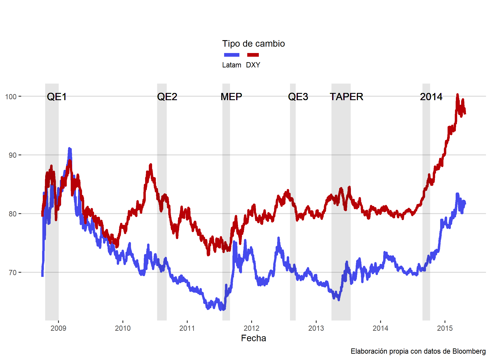

\pagenumbering{arabic} 


```{r setup, include=FALSE, warning=FALSE}
knitr::opts_chunk$set(echo = TRUE, warning = FALSE, time_it = TRUE)
```

```{r librerias, echo = FALSE, warning = FALSE, message = FALSE, include=FALSE}
library(tidyverse)
library(magrittr)
library(fixest)
library(showtext)
library(extrafont)

loadfonts()
fonttable()
font_add_google("Gochi Hand", "gochi")
font_add_google("Schoolbell", "bell")
font_add_google("Covered By Your Grace", "grace")
font_add_google("Rock Salt", "rock")
font_add_google('Montserrat', 'mon')
font_add_google('Noto Sans JP', 'rob')

## Automatically use showtext to render text for future devices
showtext_auto()
```


```{r datos, include = FALSE, echo=FALSE, message = FALSE}

options(scipen = 999)

# Sector financiero
yields <- readxl::read_xlsx("data/raw/Datos.xlsx", sheet = "Yields", 
                            col_types = c("date", "numeric", "numeric", "numeric", "numeric", "numeric", "numeric",
                                          "numeric", "numeric", "numeric", "numeric", "numeric", "numeric",
                                          "numeric", "numeric", "numeric", "numeric", "numeric", "numeric",
                                          "numeric", "numeric")) %>% 
  select("Date", "Brazil", "Chile", "Colombia", "Mexico", "Peru")


stock_market <- readxl::read_xlsx("data/raw/Datos.xlsx", sheet = "Headline stock market indices") %>% 
  select("Date", "Brazil", "Chile", "Colombia", "Mexico", "Peru")

fx <- readxl::read_xlsx("data/raw/Datos.xlsx", sheet = "FX DATA") %>% 
  select("Date", "Brazil", "Chile", "Colombia", "Mexico", "Peru")

# Sector real

Debt_gdp <- readxl::read_xlsx("data/raw/Datos_2.xlsx", sheet = "Debt_gdp")

CDS_5y <- readxl::read_xlsx("data/raw/Datos_2.xlsx", sheet = "CDS_5Y")

CPI <- readxl::read_xlsx("data/raw/Datos_2.xlsx", sheet = "CPI")

Current_account <- readxl::read_xlsx("data/raw/Datos_2.xlsx", sheet = "Current_account")

GDP <- readxl::read_xlsx("data/raw/Datos_2.xlsx", sheet = "GDP")

Reserves <- readxl::read_xlsx("data/raw/Datos_2.xlsx", sheet = "Reserves")

Rate <- readxl::read_xlsx("data/raw/Datos_2.xlsx", sheet = "Rate")

FXfig <- read_csv('data/raw/FX.csv') %>%
    janitor::clean_names()

```


```{r limpieza de bases de datos, include = FALSE, echo=FALSE}

# Sector financiero

yields <- yields %>% 
  mutate(Change_yield_Brazil = lead(Brazil) - lag(Brazil), Change_yield_Chile = lead(Chile) - lag(Chile),
         Change_yield_Colombia = lead(Colombia) - lag(Colombia), Change_yield_Mexico = lead(Mexico) - lag(Mexico),
         Change_yield_Peru = lead(Peru) - lag(Peru)) %>% 
  select(- Mexico, - Brazil, -Chile, - Colombia, - Peru) %>% 
  pivot_longer(-Date, names_to = "Country", values_to = "Yields") 

yields$Date <- as.Date(yields$Date, format = '%Y-%m-%d') 

stock_market <- stock_market %>% 
  mutate(Change_sm_Brazil = lead(Brazil) - lag(Brazil), Change_sm_Chile = lead(Chile) - lag(Chile),
         Change_sm_Colombia = lead(Colombia) - lag(Colombia), Change_sm_Mexico = lead(Mexico) - lag(Mexico),
         Change_sm_Peru = lead(Peru) - lag(Peru)) %>% 
  select(- Mexico, - Brazil, -Chile, - Colombia, - Peru) %>% 
  pivot_longer(-Date, names_to = "Country", values_to = "SI") 
  
stock_market$Date <- as.Date(stock_market$Date, format = '%Y-%m-%d') 


fx <- fx %>% 
  mutate(Change_fx_Brazil = lead(Brazil) - lag(Brazil), Change_fx_Chile = lead(Chile) - lag(Chile),
         Change_fx_Colombia = lead(Colombia) - lag(Colombia), Change_fx_Mexico = lead(Mexico) - lag(Mexico),
         Change_fx_Peru = lead(Peru) - lag(Peru)) %>% 
  select(- Mexico, - Brazil, -Chile, - Colombia, - Peru) %>% 
  pivot_longer(-Date, names_to = "Country", values_to = "FX") 

fx$Date <- as.Date(fx$Date, format = '%Y-%m-%d') 


yields <- yields %>%
  mutate(D1 = case_when(Date == "2008-11-25" ~ 1, TRUE ~ 0), D2 = case_when(Date == "2008-12-02" ~ 1, TRUE ~ 0),
         D3 = case_when(Date == "2008-12-16" ~ 1, TRUE ~ 0), D4 = case_when(Date == "2009-01-28" ~ 1, TRUE ~ 0),
         D5 = case_when(Date == "2009-03-18" ~ 1, TRUE ~ 0), D6 = case_when(Date == "2010-08-10" ~ 1, TRUE ~ 0),
         D7 = case_when(Date == "2010-08-27" ~ 1, TRUE ~ 0), D8 = case_when(Date == "2010-09-21" ~ 1, TRUE ~ 0),
         D9 = case_when(Date == "2010-10-15" ~ 1, TRUE ~ 0), D10 = case_when(Date == "2010-11-03" ~ 1, TRUE ~ 0),
         D11 = case_when(Date == "2011-08-09" ~ 1, TRUE ~ 0), D12 = case_when(Date == "2011-08-26" ~ 1, TRUE ~ 0),
         D13 = case_when(Date == "2011-09-21" ~ 1, TRUE ~ 0), D14 = case_when(Date == "2012-08-22" ~ 1, TRUE ~ 0),
         D15 = case_when(Date == "2012-08-31" ~ 1, TRUE ~ 0), D16 = case_when(Date == "2012-09-13" ~ 1, TRUE ~ 0),
         D17 = case_when(Date == "2013-03-20" ~ 1, TRUE ~ 0), D18 = case_when(Date == "2013-05-01" ~ 1, TRUE ~ 0),
         D19 = case_when(Date == "2013-05-22" ~ 1, TRUE ~ 0), D20 = case_when(Date == "2013-06-19" ~ 1, TRUE ~ 0),
         D21 = case_when(Date == "2013-07-11" ~ 1, TRUE ~ 0), D22 = case_when(Date == "2013-10-30" ~ 1, TRUE ~ 0),
         D23 = case_when(Date == "2013-12-18" ~ 1, TRUE ~ 0), D24 = case_when(Date == "2014-09-17" ~ 1, TRUE ~ 0),
         D25 = case_when(Date == "2014-10-29" ~ 1, TRUE ~ 0))


stock_market <- stock_market %>%
  mutate(D1 = case_when(Date == "2008-11-25" ~ 1, TRUE ~ 0), D2 = case_when(Date == "2008-12-02" ~ 1, TRUE ~ 0),
         D3 = case_when(Date == "2008-12-16" ~ 1, TRUE ~ 0), D4 = case_when(Date == "2009-01-28" ~ 1, TRUE ~ 0),
         D5 = case_when(Date == "2009-03-18" ~ 1, TRUE ~ 0), D6 = case_when(Date == "2010-08-10" ~ 1, TRUE ~ 0),
         D7 = case_when(Date == "2010-08-27" ~ 1, TRUE ~ 0), D8 = case_when(Date == "2010-09-21" ~ 1, TRUE ~ 0),
         D9 = case_when(Date == "2010-10-15" ~ 1, TRUE ~ 0), D10 = case_when(Date == "2010-11-03" ~ 1, TRUE ~ 0),
         D11 = case_when(Date == "2011-08-09" ~ 1, TRUE ~ 0), D12 = case_when(Date == "2011-08-26" ~ 1, TRUE ~ 0),
         D13 = case_when(Date == "2011-09-21" ~ 1, TRUE ~ 0), D14 = case_when(Date == "2012-08-22" ~ 1, TRUE ~ 0),
         D15 = case_when(Date == "2012-08-31" ~ 1, TRUE ~ 0), D16 = case_when(Date == "2012-09-13" ~ 1, TRUE ~ 0),
         D17 = case_when(Date == "2013-03-20" ~ 1, TRUE ~ 0), D18 = case_when(Date == "2013-05-01" ~ 1, TRUE ~ 0),
         D19 = case_when(Date == "2013-05-22" ~ 1, TRUE ~ 0), D20 = case_when(Date == "2013-06-19" ~ 1, TRUE ~ 0),
         D21 = case_when(Date == "2013-07-11" ~ 1, TRUE ~ 0), D22 = case_when(Date == "2013-10-30" ~ 1, TRUE ~ 0),
         D23 = case_when(Date == "2013-12-18" ~ 1, TRUE ~ 0), D24 = case_when(Date == "2014-09-17" ~ 1, TRUE ~ 0),
         D25 = case_when(Date == "2014-10-29" ~ 1, TRUE ~ 0))

fx <- fx %>%
  mutate(D1 = case_when(Date == "2008-11-25" ~ 1, TRUE ~ 0), D2 = case_when(Date == "2008-12-02" ~ 1, TRUE ~ 0),
         D3 = case_when(Date == "2008-12-16" ~ 1, TRUE ~ 0), D4 = case_when(Date == "2009-01-28" ~ 1, TRUE ~ 0),
         D5 = case_when(Date == "2009-03-18" ~ 1, TRUE ~ 0), D6 = case_when(Date == "2010-08-10" ~ 1, TRUE ~ 0),
         D7 = case_when(Date == "2010-08-27" ~ 1, TRUE ~ 0), D8 = case_when(Date == "2010-09-21" ~ 1, TRUE ~ 0),
         D9 = case_when(Date == "2010-10-15" ~ 1, TRUE ~ 0), D10 = case_when(Date == "2010-11-03" ~ 1, TRUE ~ 0),
         D11 = case_when(Date == "2011-08-09" ~ 1, TRUE ~ 0), D12 = case_when(Date == "2011-08-26" ~ 1, TRUE ~ 0),
         D13 = case_when(Date == "2011-09-21" ~ 1, TRUE ~ 0), D14 = case_when(Date == "2012-08-22" ~ 1, TRUE ~ 0),
         D15 = case_when(Date == "2012-08-31" ~ 1, TRUE ~ 0), D16 = case_when(Date == "2012-09-13" ~ 1, TRUE ~ 0),
         D17 = case_when(Date == "2013-03-20" ~ 1, TRUE ~ 0), D18 = case_when(Date == "2013-05-01" ~ 1, TRUE ~ 0),
         D19 = case_when(Date == "2013-05-22" ~ 1, TRUE ~ 0), D20 = case_when(Date == "2013-06-19" ~ 1, TRUE ~ 0),
         D21 = case_when(Date == "2013-07-11" ~ 1, TRUE ~ 0), D22 = case_when(Date == "2013-10-30" ~ 1, TRUE ~ 0),
         D23 = case_when(Date == "2013-12-18" ~ 1, TRUE ~ 0), D24 = case_when(Date == "2014-09-17" ~ 1, TRUE ~ 0),
         D25 = case_when(Date == "2014-10-29" ~ 1, TRUE ~ 0))


# Sector Real

CDS_5y <- CDS_5y  %>% 
    pivot_longer(-Date, names_to = "Country", values_to = "CDS")

CPI <- CPI  %>% 
    pivot_longer(-Date, names_to = "Country", values_to = "CPI")

Current_account <- Current_account  %>% 
    pivot_longer(-Date, names_to = "Country", values_to = "CA")

Debt_gdp <- Debt_gdp  %>% 
    pivot_longer(-Date, names_to = "Country", values_to = "DEBTGDP")

GDP <- GDP  %>% 
    pivot_longer(-Date, names_to = "Country", values_to = "GDP")

SR_1 <- full_join(CDS_5y, CPI)

SR_2 <- full_join(SR_1,Current_account)

SR_3 <- full_join(SR_2, Debt_gdp)

SR <- full_join(SR_3, GDP)

# Nuevas bases de datos

yields1 <- yields %>% 
  pivot_wider(names_from = Country, values_from = Yields) %>% 
  rename(Brazil = "Change_yield_Brazil", Chile = "Change_yield_Chile", Colombia = "Change_yield_Colombia",
         Mexico = "Change_yield_Mexico", Peru = "Change_yield_Peru") %>% 
  pivot_longer(cols = c(Brazil, Chile, Colombia, Mexico, Peru), names_to = "Country", values_to = "Yields")

yields_SR <- full_join(yields1, SR) 

yields_SR$Date <- as.Date(yields_SR$Date, format = '%Y-%m-%d') 

yields_SR <- yields_SR %>% 
   mutate(DLSAP1 = case_when(Date == "2008-11-25" ~ 1,
                             Date == "2008-12-16" ~ 1,
                             Date == "2009-03-18" ~ 1,
                             TRUE ~ 0), TAPER = case_when(Date == "2013-05-22" ~ 1,
                             Date == "2013-06-19" ~ 1,
                             TRUE ~ 0))


fx1 <- fx %>% 
  pivot_wider(names_from = Country, values_from = FX) %>% 
  rename(Brazil = "Change_fx_Brazil", Chile = "Change_fx_Chile", Colombia = "Change_fx_Colombia",
         Mexico = "Change_fx_Mexico", Peru = "Change_fx_Peru") %>% 
  pivot_longer(cols = c(Brazil, Chile, Colombia, Mexico, Peru), names_to = "Country", values_to = "FX")
  
  
  
fx_SR <- full_join(fx1, SR) 
fx_SR$Date <- as.Date(fx_SR$Date, format = '%Y-%m-%d') 
fx_SR <- fx_SR %>% 
   mutate(DLSAP1 = case_when(Date == "2008-11-25" ~ 1,
                             Date == "2008-12-16" ~ 1,
                             Date == "2009-03-18" ~ 1,
                             TRUE ~ 0), TAPER = case_when(Date == "2013-05-22" ~ 1,
                             Date == "2013-06-19" ~ 1,
                             TRUE ~ 0))


SI1 <- stock_market %>% 
  pivot_wider(names_from = Country, values_from = SI) %>% 
  rename(Brazil = "Change_sm_Brazil", Chile = "Change_sm_Chile", Colombia = "Change_sm_Colombia",
         Mexico = "Change_sm_Mexico", Peru = "Change_sm_Peru") %>% 
  pivot_longer(cols = c(Brazil, Chile, Colombia, Mexico, Peru), names_to = "Country", values_to = "SI")
  
  
  

SI_SR <- full_join(SI1, SR) 
SI_SR$Date <- as.Date(SI_SR$Date, format = '%Y-%m-%d') 
SI_SR <- SI_SR %>% 
   mutate(DLSAP1 = case_when(Date == "2008-11-25" ~ 1,
                             Date == "2008-12-16" ~ 1,
                             Date == "2009-03-18" ~ 1,
                             TRUE ~ 0), TAPER = case_when(Date == "2013-05-22" ~ 1,
                             Date == "2013-06-19" ~ 1,
                             TRUE ~ 0))
```


**\textcolor{BlueViolet}{1    INTRODUCCIÓN}**

La principal contribución de este trabajo es analizar si la política monetaria no convencional en Estados Unidos generó un impacto significativo para las economías de Latinoamérica entre 2008 y 2015, debido a que se cambió el enfoque tradicional de la política monetaria por la magnitud de la crisis. Los principales motivos por los cuáles se espera que el efecto para las economías de Latinoamérica sea significativo, es por su fuerte dependencia al dólar y, que en ocasiones, un gran porcentaje de su deuda se encuentran denominada en esta moneda, vínculos financieros fuertes con Estados Unidos dentro de la región y la relevancia que para estos países representan las exportaciones de materias primas cuyos precios se encuentran denominados en dólares.

La segunda contribución es identificar si el papel que juegan los fundamentales en condicionar la respuesta de los países de Latinoamérica a las políticas monetarias no convencionales de Estados Unidos difiere a lo largo de los distintos episodios.

A lo largo de  diversos estudios se han identificado las siguientes características: en primer lugar, estos instrumentos de política monetaria no convencional han contribuido a mejorar las condiciones financieras. En segundo lugar, los efectos subsecuentes de estos programas suelen ser menores con el paso del tiempo. Tercero, los principales canales de transmisión de la política monetaria no convencional son: 

i.	Canal de balance de portafolio: La compra de activos de larga duración por parte de la Reserva Federal, bonos respaldados por hipotecas y bonos del gobierno, llevan a una disminución de la oferta de estos activos, lo que provoca una reducción en el rendimiento de los mismos y un efecto sustitución hacia otros activos de mayor riesgo en busca de mayor rendimiento, principalmente hacia mercados emergentes. Este efecto provoca una disminución en las primas de riesgo, incrementa el precio de los activos y disminuye los rendimientos en mercado emergentes.

ii.	Canal de señalización: Cuando las expectativas de que la política monetaria acomodaticia permanecerá por cierto periodo de tiempo, manteniendo las tasas de referencia bajas, el componente de riesgo neutral del rendimiento de los bonos suele disminuir. El diferencial de tasas de interés con respecto a los mercados emergentes tiende a ser persistente, lo que provoca flujo de capitales hacía estos mercados.\footnote{Lavigne R., Sarker S. y Vasishtha G. (2014). Spillover Effects of Quantitative Easing on Emerging - Market Economies. [Documento en línea] Bank of Canada.} 

iii.	Canal de tipo de cambio: La salida de flujos de Estados Unidos en busca de mayor rendimiento, provoca que el dólar se deprecie y con ello que la demanda por bienes y servicios foráneos disminuya en detrimento de las exportaciones de mercados emergentes. La apreciación en las monedas de los países emergentes, ceteris paribus depende de la cantidad de flujos que entren a cada país.

A lo largo del periodo que va de 2008 a 2015, se observaron distintas fases de la política monetaria no convencional de la Reserva Federal, las compras de activos a gran escala (LSAP, por sus siglas en inglés), el programa de extensión de madurez (MEP, por sus siglas en inglés) y el periodo de disminución de compra de activos mejor conocido como “Taper Talk Period” que se caracterizó por ser un episodio de volatilidad en los mercados internacionales financieros. Los efectos que provocaron tanto en Estados Unidos como en los mercados emergentes fueron desiguales, tanto en la fase que se encontraba la política monetaria, así como las características particulares del país y su relación con Estados Unidos.

En primer lugar, se estiman los efectos sobre los bonos gubernamentales y los tipos de cambio para 5 países de la región de Latinoamérica, este es un enfoque que toma en cuenta las reacciones de los países  a través de movimientos en ciertos activos financieros. En la segunda parte, se estima un modelo simple que mide la influencia de los fundamentales macroeconómicos específicos de cada país en la transmisión de las perturbaciones financieras de Estados Unidos.


**\textcolor{BlueViolet}{2   METODOLOGÍA}**


**\textcolor{BlueViolet}{2.1   Estrategia empírica y descripción de variables}**

El modelo a estimar se basa en Borallo et al. (2016), donde a través de un modelo de estudio de eventos se analiza los efectos de los cambios de política monetaria en Estados Unidos.  Las ecuaciones 1 y 2 muestran la forma funcional de los modelos que se pretenden analizar.


**1er modelo**

\begin{equation}
\Delta Y_{it} = \alpha_i+ \sum_{j=1}^{25}\beta_j D_j + \epsilon_{it}
\end{equation}

donde:

$y_{it}$ el cambio de dos días en el precio de los activos (del día previo al día posterior)  $y_{it+1}- y_{it-1}$

$\sum_{j=1}^{25}$ denota los anuncios de política monetaria contemplados para este análisis

$\alpha_i$ denota un efecto fijo del país

$D_j$ denota la dummy de cada evento

$\beta_j$ denota el coeficiente asociado con la dummy de cada evento 

**2do modelo**

\begin{equation}
\Delta Y_{ij} = \alpha_i+ \beta D_j^s + \gamma CC_{it-1} + \delta D_j^s CC_{it-1} +\epsilon_{it}
\end{equation}

donde: 

$y_{ij}$ el cambio de dos días en el precio de los activos (del día previo al día posterior)  $y_{it+1}- y_{it-1}$ en el país $i$ en la fecha $j$

$CC_{it-1}$ denota las características de los países

$D_j^{s}$ denota la dummy de cada evento que fueron significativos en el primer modelo

$D_j^{s}CC_{it-1}$ denota la interacción entre las dummies de los eventos significativos y las características de los países 

**\textcolor{BlueViolet}{2.2   Identificación}**

Es un modelo de datos panel que analiza el cambio en los mercados extranjeros después del anuncio de política monetaria, bajo el supuesto de que las noticias económicas no afectan la decisión de política en ese periodo corto de tiempo. 

Por simplicidad, se evita hacer la diferenciación que algunos otros estudios realizan, de distinguir en los anuncios entre el impacto y las intenciones futuras sobre la política y se procede a considerar estos eventos como no anticipados. 

**\textcolor{BlueViolet}{2.3   Descripción de datos}**

Se utilizan datos diarios del 1 de octubre del 2008 al 24 de abril del 2015 para tres tipos de activos, rendimientos de los bonos soberanos de 10 años en moneda local y tipos de cambio bilateral relativo al dólar americano para 5 países de Latam:
 
 
\newlist{multiitem}{itemize}{1}
\setlist[multiitem]{
    label=\textbullet,
    before=\begin{multicols}{2},
    after=\end{multicols}
}
 
\begin{multiitem}
    \item Brasil
    \item Chile
    \item Colombia
    \item México
    \item Perú
\end{multiitem}


De igual forma los fundamentales macroecónomicos que se incluyen son los siguientes: Proxy de crecimiento del PIB mensual, inflación mensual, Credit Default Swap de 5 años, deuda como proporción del PIB, cuenta corriente como proporción del PIB.

La tabla 4 en el anexo, describe un conjunto de anuncios oficiales y discursos por parte de la Reserva Federal que se caracterizaron por incluir la implementación de instrumentos no convencionales de política monetaria desde noviembre del 2008.

**\textcolor{BlueViolet}{2.4   Estadísticos descriptivos}**

i. Tipo de cambio con respecto al dólar

Se puede observar como para los países observados de la muestra hubo variaciones de entre 5% a 10% con respecto a su media, lo que mostraría que fue un episodio de mucha volatilidad. Así como en el gráfico se puede observar que el índice de monedas de Latam se depreciaba, al subir, cuando al mismo tiempo el indice para el dólar ganaba valor para los periodos posteriores al 2014 y con un comportamiento inverso en el periodo de "QE".

\begin{table}[H]
  \begin{center}
    \begin{tabular}{| c | c | c | c | c | c |}
      \hline
País	& Obs.	& Media	& D.e.	& Min	& Max \\ \hline
Brasil	& 1604 &	2.03	 & 0.33 &	1.53	& 3.29 \\
Chile	& 1639	& 527.18 &	51.34 &	456.38 &	682.75 \\
Colombia	& 1638 &	1968.22	& 206.55	& 1748.50	& 2687.79 \\
México	& 1638	& 13.06	& 0.76	& 11.19	& 15.62 \\
Perú	& 1631	& 2.81	& 0.15 &	2.53 &	3.25 \\ \hline
    \end{tabular}
    \caption{Tipo de cambio con respecto al dólar}
  \end{center}
\end{table}

<!-- ii. Índice bursátil -->

<!-- \begin{table}[H] -->
<!--   \begin{center} -->
<!--     \begin{tabular}{| c | c | c | c | c | c |} -->
<!--       \hline -->
<!-- País	& Obs.	& Media	& D.e.	& Min	& Max \\ \hline -->
<!-- Brasil	& 1572	& 28997.25	& 7939.61	& 12712.28	& 43713.74 \\ -->
<!-- Chile	& 1583	& 7.59 &	1.72 &	3.33 &	10.66 \\ -->
<!-- Colombia &	1553	& 6.59 &	1.53 &	2.69 &	8.94 \\ -->
<!-- México	& 1591	& 2782.22	& 557.51	& 1100.30	& 3680.45 \\ -->
<!-- Perú	& 1588 &	5999.74 &	1683.26 &	1944.81 &	9018.22 \\ \hline -->
<!--     \end{tabular} -->
<!--     \caption{Índice bursátil} -->
<!--   \end{center} -->
<!-- \end{table} -->

<!-- i.	Rendimiento de los bonos soberanos de 10 años en moneda local  -->

<!-- \begin{table}[H] -->
<!--   \begin{center} -->
<!--     \begin{tabular}{| c | c | c | c | c | c |} -->
<!--       \hline -->
<!-- País	& Obs.	& Media	& D.e.	& Min	& Max \\ \hline -->
<!-- Brasil	& 1253	& 11.86 &	1.43 & 	9.11	& 17.91 \\ -->
<!-- Chile	& 1019	& 5.37 &	0.55	& 3.98	& 7.22 \\ -->
<!-- Colombia	& 1122	& 7.22 & 1.54 &	4.69 &	13.81 \\ -->
<!-- México	& 1609	& 6.55	& 1.04	& 4.41	& 10.9 \\ -->
<!-- Perú	& 1252	& 5.70 &	0.96 &	3.94 & 10.05 \\ \hline -->
<!--     \end{tabular} -->
<!--     \caption{Rendimiento de los bonos soberanos de 10 años en moneda local } -->
<!--   \end{center} -->
<!-- \end{table} -->

```{r, echo = FALSE}

g3 <- FXfig %>%
    select(date, dxy, citi_latam_fx) %>% 
    filter(!is.na(citi_latam_fx)) %>%
    filter(!is.na(dxy)) %>% 
    mutate(fecha = parse_date(date,"%d/%m/%Y")) %>%
    pivot_longer(c(dxy, citi_latam_fx), 
                 names_to = 'Tipo_de_cambio', 
                 values_to = 'valor') %>%
    ggplot() + 
    geom_line(aes(x = fecha, y = valor, color = Tipo_de_cambio),
              size = 13/10) +
    geom_vline(xintercept = as.numeric(as.Date(c("2008-11-25", "2010-08-10", "2011-08-09","2012-08-22","2013-05-22","2014-09-17"))),
               linetype = 1,
               size = c(7,5,4,3,10,4),
               alpha = 1 / 10) +
    scale_x_date(breaks = ("1 year"), 
                 date_labels = '%Y') +
    scale_color_manual(values = c("#454AED", "#B80006"), 
                       labels = c('Latam', 'DXY')) +
    #scale_fill_manual(values = c("#454AED", "#B80006", "#60D394")) +
    #scale_alpha_manual(values = c(1, 0.5, 0.2)) +
    labs(color = 'Tipo de cambio', 
         y = NULL, 
         x = 'Fecha', 
         title = '', 
         subtitle = '', 
         caption = 'Elaboración propia con datos de Bloomberg') +
    ggthemes::theme_hc() +
    theme(legend.position = 'top', 
          text = element_text(family = 'rob', size = 10)) +
    guides(color = guide_legend(title.position = 'top',
                                label.position = 'bottom', 
                                title.hjust = 0.55, 
                                override.aes = list(linetype = 'solid', 
                                                    shape = 2, 
                                                    size = 2), 
                                keyheight = 0, 
                                keywidth = 0.2)) +
  geom_text(x = as.numeric(as.Date("2008-12-25")), y = 100, label = "QE1") +
  geom_text(x = as.numeric(as.Date("2010-09-10")), y = 100, label = "QE2") +
   geom_text(x = as.numeric(as.Date("2011-09-09")), y = 100, label = "MEP") +
   geom_text(x = as.numeric(as.Date("2012-09-22")), y = 100, label = "QE3") +
   geom_text(x = as.numeric(as.Date("2013-06-22")), y = 100, label = "TAPER") +
   geom_text(x = as.numeric(as.Date("2014-10-17")), y = 100, label = "2014")

```



A continuación se presentan los estadísticos descriptivos de algunos fundamentales de los países de Latam, como proxy de crecimiento e inflación, para contextualizar que algunos países para el periodo de análisis tenían niveles bajos de crecimiento y con niveles altos de inflación, por encima de la meta de su banco central, lo que pudo haber influido en un mayor o menor impacto ante las políticas monetarias no convencionales de la Reserva Federal.

ii. Proxy de crecimiento económico

\begin{table}[H]
  \begin{center}
    \begin{tabular}{| c | c | c | c | c | c |}
      \hline
País	& Obs.	& Media	& D.e.	& Min	& Max \\ \hline
Brasil	& 1902	& 2.99 &	3.84 & 	-4.94	& 12.23 \\
Chile	& 1802	& 4.38 &	2.87	& -3.8	& 12.63 \\
Colombia	& 1863	& 4.50 & 2.21 &	-0.8 &	8.97 \\
México	& 1863	& 2.23	& 3.49	& -11	& 7.44 \\
Perú	& 1902	& 5.80 &	2.79 &	7.44 & 12.83 \\ \hline
    \end{tabular}
    \caption{Proxy de crecimiento económico mensual }
  \end{center}
\end{table}


iii. Inflación

\begin{table}[H]
  \begin{center}
    \begin{tabular}{| c | c | c | c | c | c |}
      \hline
País	& Obs.	& Media	& D.e.	& Min	& Max \\ \hline
Brasil	& 1561	& 5.76 &	0.79 & 	4.17	& 7.31 \\
Chile	& 1561	& 2.80 &	2.12	& -2.30	& 9.80 \\
Colombia	& 1561	& 3.18 & 1.39 &	1.76 &	7.94 \\
México	& 1561	& 4.22	& 0.86	& 3.04	& 6.53 \\
Perú	& 1561	& 3.07 &	1.38 &	0.25 & 6.75 \\ \hline
    \end{tabular}
    \caption{Inflación mensual }
  \end{center}
\end{table}
**\textcolor{BlueViolet}{3   RESULTADOS}**

Los resultados de este trabajo son consistentes con la literatura. El análisis de datos panel bajo el estudio de eventos de política monetaria no convencional muestran un mayor efecto significativo para los precios de los activos de Latinoamérica con el primer anuncio de ciclo de expansión cuantitativa en el 2008 – 2009 y con el periodo de disminución de compra de activos en el 2013, así como una mayor respuesta para el rendimiento de los bonos soberanos y los tipos de cambio de las economías de Latinoamérica. De igual forma, las características de los países fueron más decisivas para explicar las diferencias en la reacción a los anuncios de QE que en respuesta a las noticias sobre el proceso de puesta a punto.


1.	Mercados de bonos

En la tabla 6, columna 2, se puede observar que las variaciones de los bonos fueron más significativas en el LSAP-1 con una disminución promedio de 28 puntos básicos, cuando el promedio para el periodo seleccionado fue una disminución de 3.8 puntos básicos.

2.	Tipos de cambio

En la tabla 6, columna 3, se puede observar que en el LSAP-1 los datos resultaron ser más significativos. En primer lugar se puede observar un efecto de depreciación (signo positivo) para las primeras fechas del LSAP-1 y posteriormente una apreciación (signo negativo) en el 2009.

Esto se puede explicar debido a que en un principio los inversionistas comenzaron a mover los capitales hacia activos más seguros, para después mediante un rebalanceo de portafolios buscar rendimiento en los países emergentes y principalmente en aquellos que tuvieran un mayor diferencial de tasas como en el caso de México y Brasil. 

De igual forma el periodo del segundo semestre del 2013 cuando se comenzaba a sugerir la moderación o el final de la política monetaria expansiva, tuvo un efecto significativo depreciando las monedas.

<!-- 3.	Índices Bursátiles -->

<!-- La tabla 6 y 7 muestra los principales resultados de los índices bursátiles. -->

<!-- Se puede observar que los coeficientes en el LSAP-1 y LSAP-3 son positivos y significativos en los países de la muestra, lo que sugiere que flujos de países desarrollados como Estados Unidos comenzaron a entrar en otro tipo de instrumentos de países emergentes buscando un mayor rendimiento. Sin embargo, el 21 de septiembre del 2011 cuando la Reserva Federal anunció el programa de extensión de madurez oficialmente, se dieron disminuciones. -->


3.- Modelo con fundamentales macroeconómicos

En la tabla 7, se puede observar que en la mitad de los casos la dummy para el LSAP1 fueron significativos, lo que indica la relevancia de esta variable en la transmisión de los choques de política monetaria. Hay dos características de los países que interactúan con el primer grupo de políticas de la FED: la inflación y la deuda como proporción del PIB. El signo para el caso de la inflación puede responder a que para un periodo en el que la gran mayoría de las monedas de Latam se apreciaron, al tener inflación alta y ofrecer mayores niveles de tasa que otros países, el nivel de carry pudo haber resultado más atractivo, como el caso de México y Brasil.

Para el periodo de Taper la gran mayoría de las variables estructurales no son significativas, salvo la inflación de nueva cuenta.

**\textcolor{BlueViolet}{4   REFERENCIAS}**

1.	Anaya, P., Hachula, M., Offermanns, C. (2015). Spillovers of U.S. Unconventional Monetary Policy to Emerging Markets: The Roles of Capital Flows. Freie Univerität Berlin, School of Business & Economics.
2.	Bank for International Settlements (2014). The Transmission of unconventional monetary policy to the emerging markets. Bank of International Settlements. BIS Papers No. 78.
3.	Baumesiter, C., Benati, L. (2013). Unconventional Monetary Policy and the Great Recession. Bank of Canada & Banque de France. 
4.	Bhattarai, S., Chatterjee, A., Yong Park W. (2018). Effects of US Quantitative Easing on Emerging Market Economies. ABD Institute. ABDI Working Paper Series No.803.
5.	Borallo, F., Hernando, I., Vallés, J. (2016). The effects of US Unconventional Monetary Policies in Latin America. Banco de España. Documentos de Trabajo No. 1606.


**\textcolor{BlueViolet}{5   ANEXOS}**


\begin{table}[H]
  \begin{center}
  \resizebox{18cm}{18cm} {
    \begin{tabular}{| m{3cm} | m{5cm} | m{15cm} |}
      \hline
\multicolumn{3}{|c|}{Juntas del Comité Federal de Mercado Abierto (CFMA) y eventos importantes (Nov 2008 - Oct 2014)} \\ \hline
\rowcolor{Gray}\multicolumn{3}{|c|}{"First Large Scale Asset Purchase" (LSAP)} \\ \hline
11/25/2008	 & Anuncio &	La Reserva Federal anuncia la compra de "Mortage Back Securities" respaldadas por agencias del gobierno y la creación del "Term Asset Backed Securities Loan Facility" \\
12/01/2008	& Discurso (Austin)	& Bernanke da pistas de posibles futuras compras de bonos gubernamentales \\
12/16/2008	& Declaración CFMA	& La Reserva Federal recorta la tasa de fondos federales a cero \\
01/28/2009	& Declaración CFMA	& La Reserva Federal anuncia "Primary Dealer Credit Facility", "Term Securities Lending Facility" y AMLF \\
03/18/2009	& Declaración CFMA &	La Reserva Federal extiende su programa de compras de MBS y anuncia el comienzo de compras de bonos gubernamentales \\
\rowcolor{Gray}\multicolumn{3}{|c|}{"Second LSAP"} \\ \hline
08/10/2010	& Declaración CFMA &	La Reserva Federal anuncia sus intenciones de comprar bonos gubernamentales de largo plazo a través de la reinversión de los pagos de sus MBS \\
08/27/2010	& Discurso (Jackson Hole) &	Discurso de Bernanke en Jackson Hole \\
09/21/2010	& Declaración CFMA	& De acuerdo al CFMA, la tasa de interés de corto plazo se mantendrá en niveles bajos por un largo periodo de tiempo \\
10/15/2010	& Discurso (Indiana) &	De acuerdo con el presidente de la Reserva Federal Bernanke, nuevas medidas podrían ser necesarias \\
11/02/2010	& Declaración CFMA &	La Reserva Federal decide comprar 600 billones de dólares adicionales  de bonos gubernamentales de largo plazo \\
\rowcolor{Gray}\multicolumn{3}{|c|}{"Maturity Extension Program" (MEP)} \\ \hline
08/09/2011	& Declaración CFMA &	De acuerdo al CFMA, la tasa de interés de corto plazo se mantendrá en niveles bajos por un largo periodo de tiempo y tomarán nuevas medidas si resultan necesarias \\
08/26/2011	& Discurso	& Discurso de Bernanke en Jackson Hole \\
09/21/2011	& Declaración CFMA &	La Reserva Federal anuncia su "Maturity Expansion Program" \\
\rowcolor{Gray}\multicolumn{3}{|c|}{"Third LSAP"} \\ \hline
08/22/2012	& Minutas CFMA &	La Reserva Federal tomará nuevas medidas en caso de ser necesarias \\
08/31/2012	& Discurso (Jackson Hole) & El presidente de la Reserva Federal Bernanke sugiere nuevo \\
\rowcolor{Gray}\multicolumn{3}{|c|}{"Quantitative Easing"} \\ \hline
09/13/2012	& Declaración CFMA &	La Reserva Federal anuncia nuevo "Quantitative Easing"
Eventos en el 2013 \\
03/20/2013	& Declaración CFMA	& La Reserva Federal continuará con su política monetaria acomodaticia hasta que ciertos objetivos de desempleo e inflación sean alcanzados \\
05/01/2013	& Declaración CFMA & 	CFMA: la política monetaria acomodaticia se mantendrá por un largo periodo de tiempo \\
\rowcolor{Gray}\multicolumn{3}{|c|}{"Taper Talk Period"} \\ \hline
05/22/2013	& Testimonio y minutas CFMA &	Bernake sugiere el final de la política monetaria expansiva \\
06/19/2013	& Declaración CFMA	& La Reserva Federal sugiere que el periodo de disminución podría comenzar el próximo año \\
07/11/2013	& Minutas CFMA y discurso(NBER)	& Bernanke dice que la política monetaria de flexibilización del banco central podría continuar en el futuro inmediato \\
10/30/2013 & Declaración CFMA	& La Reserva Federal decide continuar con la política monetaria acomodaticia \\
12/18/2013	& Declaración CFMA &	Periodo de disminución se anuncia oficialmente  \\
\rowcolor{Gray}\multicolumn{3}{|c|}{Eventos en el 2014} \\ \hline
09/17/2014	& Declaración CFMA	& Anuncio de los principios y planes de normalización de la política \\
10/29/2014 &	Declaración CFMA &	Concluye el periodo de disminución de compra de activos; empieza  un periodo indefinido de orientación hacia adelante \\ \hline
    \end{tabular}
  }
    \caption{Anuncios oficiales y discursos oficiales de la reserva federal}
  \end{center}
\end{table}


\begin{table}[H]
  \begin{center}
  \resizebox{12cm}{10cm} {
    \begin{tabular}{| c | c | c |}
      \hline
\rowcolor{Gray}Variables	& Descripción	& Fuente \\ \hline
Bonos soberanos	& 10 años en moneda local	& Bloomberg \\ \hline
Tipo de cambio	& Bilateral con respecto al dólar	& Bloomberg \\ \hline
Índices bursátiles	& Agregado	& Bloomberg \\ \hline
Proxy crecimiento del PIB mensual & Variación anual & Bloomberg \\ \hline
Inflación mensual & Variación anual & Bloomberg \\ \hline
Credit default swap  & 5 años en USD & Bloomberg \\ \hline
Tasa de política monetaria & Porcentaje & Bloomberg \\ \hline
Cuenta corriente como proporción del PIB &  Porcentaje & Bloomberg \\ \hline
Deuda como proporción del PIB & Porcentaje  & Bloomberg \\ \hline
Reservas como proporción del PIB & Porcentaje & Bloomberg \\ \hline
    \end{tabular}
  }
    \caption{Definición de variables}
  \end{center}
\end{table}


\begin{table}[H]
  \begin{center}
    \begin{tabular}{ m{3cm}  c  c }
      \hline
Variables dep.	& Rendimiento de bonos 	& Tipo de cambio  \\ \hline
11/25/2008	& -0.35***	& -3.3 \\
12/01/2008 & -0.51***	& 3.4 \\
12/16/2008 & -0.25***	& -17.8 \\
01/28/2009 & -0.15**	& 12.8 \\
03/18/2009 & -0.17*	& -10.9 \\
08/10/2010 & -0.02	& -1.4 \\
08/27/2010 & 0.06	& 1.3 \\
09/21/2010 & 0.010	& -0.71 \\
10/15/2010 & 0.03	& 2.0 \\
11/02/2010 & -0.06	& -8.4 \\
08/09/2011 & -0.17	& -3.6 \\
08/26/2011 & -0.14	& -1.2 \\
09/21/2011 & 0.07	& 16.4*** \\
08/22/2012 & -0.03	& -1.5 \\
08/31/2012 & -0.01	& -1.0 \\
09/13/2012 & 0.05	& -2.6 \\
03/20/2013 & 0.07	& 1.5 \\
05/01/2013 & -0.05	& 2.7 \\
05/22/2013 & 0.15**	& 4.3 \\
06/19/2013 & 0.40***	& 9.9** \\
07/11/2013 & -0.06	& -3.8 \\
10/30/2013 & 0.09	& 2.5 \\
12/18/2013 & 0.02	& -0.29 \\
09/17/2014 & 0.03	& 0.37 \\
10/29/2014 & 0.05	& -1.6 \\ \hline
Efectos fijos por país	& Sí	& Sí \\ \hline
Observaciones	& 6,015	& 8,097 \\
R-squared	& 0.019	& 0.006 \\ \hline
    \end{tabular}
    \caption{1er Modelo: Efecto sobre activos en las fechas seleccionadas}
  \end{center}
\end{table}


\begin{table}[H]
  \begin{center}
    \begin{tabular}{ m{3cm}  c  c  c  c }
      \hline
& \multicolumn{2}{|c|} {LSAP1} & {TAPER} \\ \hline	
Variables & Dummy ($\beta$) & DummyCC ($\delta$) & Dummy ($\beta$) & DummyCC ($\delta$) \\ \hline
PIB	& -9.7**	& 1.1 & 3.8 & 0.69 \\
Inflación & 24.9*	& -5.2** & 16*** & -2.7*\\
Deuda como % del PIB & 8.3	& -0.66** &  6.5 & 0.02\\
CDS & 20.5	& -0.09** & 8.0 & -0.007 \\
Cuenta corriente & 6.7	& 5.1 & -5.7 & -3.4 \\ \hline
    \end{tabular}
    \caption{2do Modelo: Efecto sobre el tipo de cambio}
  \end{center}
\end{table}


<!-- ```{r Identificación, echo = FALSE, results='asis', warning = FALSE, message=FALSE} -->

<!-- # Regresiones -->

<!-- reg.yield <- feols(Yields ~ D1 + D2 + D3 + D4 + D5 + D6 + D7 + D8 + D9 + D10 + D11 + D12 + D13 + D14 + D15 + D16 + D17 + D18 + D19 + D20 + D21 + D22 + D23 + D24 + D25 | Country, data = yields, se = "standard") -->


<!-- reg.SI <- feols(SI ~ D1 + D2 + D3 + D4 + D5 + D6 + D7 + D8 + D9 + D10 + D11 + D12 + D13 + D14 + D15 + D16 + D17 + D18 + D19 + D20 + D21 + D22 + D23 + D24 + D25 | Country, data = stock_market, se = "standard") -->


<!-- reg.fx <- feols(FX ~ D1 + D2 + D3 + D4 + D5 + D6 + D7 + D8 + D9 + D10 + D11 + D12 + D13 + D14 + D15 + D16 + D17 + D18 + D19 + D20 + D21 + D22 + D23 + D24 + D25 | Country, data = fx, se = "standard") -->

<!-- ``` -->

<!-- ```{r Identificación 2, echo = FALSE, results='asis', warning = FALSE, message=FALSE} -->

<!-- # Regresiones con el sector real -->

<!-- ## Regresiones con yields -->
<!-- reg.yield.DLSAP1.CDS <- feols(Yields ~ DLSAP1 + CDS + DLSAP1 * CDS | Country, data = yields_SR, se = "standard") -->
<!-- reg.yield.DLSAP1.GDP <- feols(Yields ~ DLSAP1 + GDP + DLSAP1 * GDP | Country, data = yields_SR, se = "standard") -->
<!-- reg.yield.DLSAP1.CPI <- feols(Yields ~ DLSAP1 + CPI + DLSAP1 * CPI | Country, data = yields_SR, se = "standard") -->
<!-- reg.yield.DLSAP1.CA <- feols(Yields ~ DLSAP1 + CA + DLSAP1 * CA | Country, data = yields_SR, se = "standard") -->
<!-- reg.yield.DLSAP1.DEBTGDP <- feols(Yields ~ DLSAP1 + DEBTGDP + DLSAP1 * DEBTGDP | Country, data = yields_SR, se = "standard") -->

<!-- reg.yield.TAPER.CDS <- feols(Yields ~ TAPER + CDS + TAPER * CDS | Country, data = yields_SR, se = "standard") -->
<!-- reg.yield.TAPER.GDP <- feols(Yields ~ TAPER + GDP + TAPER * GDP | Country, data = yields_SR, se = "standard") -->
<!-- reg.yield.TAPER.CPI <- feols(Yields ~ TAPER + CPI + TAPER * CPI | Country, data = yields_SR, se = "standard") -->
<!-- reg.yield.TAPER.CA <- feols(Yields ~ TAPER + CA + TAPER * CA | Country, data = yields_SR, se = "standard") -->
<!-- reg.yield.TAPER.DEBTGDP <- feols(Yields ~ TAPER + DEBTGDP + TAPER * DEBTGDP | Country, data = yields_SR, se = "standard") -->


<!-- ## Regresiones con fx -->

<!-- reg.fx.DLSAP1.CDS <- feols(FX ~ DLSAP1 + CDS + DLSAP1 * CDS | Country, data = fx_SR, se = "standard") -->
<!-- reg.fx.DLSAP1.GDP <- feols(FX ~ DLSAP1 + GDP + DLSAP1 * GDP | Country, data = fx_SR, se = "standard") -->
<!-- reg.fx.DLSAP1.CPI <- feols(FX ~ DLSAP1 + CPI + DLSAP1 * CPI | Country, data = fx_SR, se = "standard") -->
<!-- reg.fx.DLSAP1.CA <- feols(FX ~ DLSAP1 + CA + DLSAP1 * CA | Country, data = fx_SR, se = "standard") -->
<!-- reg.fx.DLSAP1.DEBTGDP <- feols(FX ~ DLSAP1 + DEBTGDP + DLSAP1 * DEBTGDP | Country, data = fx_SR, se = "standard") -->

<!-- reg.fx.TAPER.CDS <- feols(FX ~ TAPER + CDS + TAPER * CDS | Country, data = fx_SR, se = "standard") -->
<!-- reg.fx.TAPER.GDP <- feols(FX ~ TAPER + GDP + TAPER * GDP | Country, data = fx_SR, se = "standard") -->
<!-- reg.fx.TAPER.CPI <- feols(FX ~ TAPER + CPI + TAPER * CPI | Country, data = fx_SR, se = "standard") -->
<!-- reg.fx.TAPER.CA <- feols(FX ~ TAPER + CA + TAPER * CA | Country, data = fx_SR, se = "standard") -->
<!-- reg.fx.TAPER.DEBTGDP <- feols(FX ~ TAPER + DEBTGDP + TAPER * DEBTGDP | Country, data = fx_SR, se = "standard") -->

<!-- ``` -->

<!-- ```{r p11, echo = FALSE, results='asis', message=FALSE} -->
<!-- etable(reg.fx.DLSAP1.CDS,  -->
<!--        reg.fx.TAPER.CDS, -->
<!--        reg.fx.DLSAP1.GDP, -->
<!--        reg.fx.TAPER.GDP, -->
<!--        reg.fx.DLSAP1.CPI, -->
<!--        reg.fx.TAPER.CPI, -->
<!--        reg.fx.DLSAP1.CA, -->
<!--        reg.fx.TAPER.CA, -->
<!--        reg.fx.DLSAP1.DEBTGDP, -->
<!--        reg.fx.TAPER.DEBTGDP, -->
<!--        title = "1er Modelo: Efecto sobre activos en las fechas seleccionadas", -->
<!--        float = TRUE, -->
<!--        fitstat = c("n", "r2"), -->
<!--        placement = "H", -->
<!--        digits = 2, -->
<!--        tex = TRUE) -->
<!-- ``` -->


<!-- # ```{r p1, echo = FALSE, results='asis', message=FALSE} -->
<!-- # etable(reg.yield,  -->
<!-- #        reg.SI, -->
<!-- #        reg.fx, -->
<!-- #        title = "1er Modelo: Efecto sobre activos en las fechas seleccionadas", -->
<!-- #        keep = "D[[:digit:]]$", -->
<!-- #        float = TRUE, -->
<!-- #        fitstat = c("n", "r2"), -->
<!-- #        placement = "H", -->
<!-- #        digits = 2, -->
<!-- #        tex = TRUE) -->
<!-- # ``` -->


<!-- ```{r p2, echo = FALSE, results='asis', message=FALSE} -->
<!-- etable(reg.yield,  -->
<!--        reg.SI, -->
<!--        reg.fx, -->
<!--        title = "1er Modelo: Efecto sobre activos en las fechas seleccionadas (Continuación)", -->
<!--        keep = "D[[:digit:]]{2}", -->
<!--        float = TRUE, -->
<!--        fitstat = c("n", "r2"), -->
<!--        placement = "H", -->
<!--        digits = 2, -->
<!--        tex = TRUE) -->
<!-- ``` -->